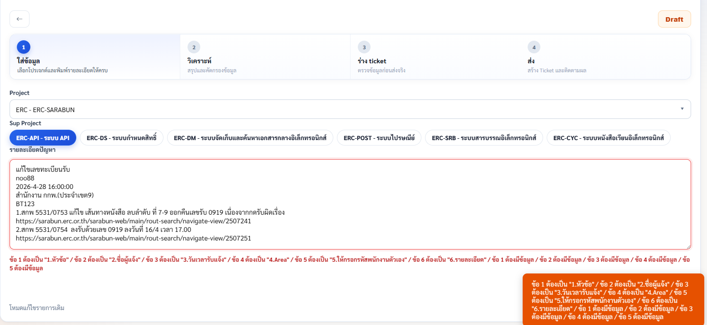

# MANA Help Desk Use Cases

วันที่จัดทำ: 2026-06-09  
ระบบ: BETIME Help Desk V3 + Odoo `tcp.txn.case`  
โมเดลตอบแชท MANA: Azure OpenAI deployment `gpt-4.1-mini`

เอกสารนี้จำลองบทสนทนาจริงของ MANA ใน flow ปัจจุบัน เพื่อดูว่าเมื่อผู้ใช้กรอกข้อมูล, วิเคราะห์, ถามต่อ, เลือกแนวทาง และส่งเข้า Odoo แล้วระบบควรตอบและทำงานอย่างไร

## Flow หลัก

1. ผู้ใช้กรอกข้อมูลหน้าแรกด้วย template 6 บรรทัด
2. ระบบ parse ข้อมูลเป็น `issueTitle`, `requester`, `employeeCode`, `reportedAt`, `department`, `contentText`
3. หน้า Analysis แสดงชื่อผู้แจ้งเป็น `ชื่อผู้แจ้ง (รหัสพนักงาน)`
4. MANA วิเคราะห์ประเภทปัญหา, priority, criteria, สาเหตุ, วิธีแก้, คำถามต่อ
5. ผู้ใช้เลือกแนวทาง เช่น ปิดเคสเอง หรือส่งต่อ Dev
6. หน้า Confirm ส่งข้อมูลเข้า Odoo
7. Odoo สร้าง Ticket พร้อม Project, Sub Project, Area, Criteria, SLA และ Assign Dev ถ้ามีการเลือก Dev

Template ที่ใช้:

```text
1.หัวข้อ :
2.ชื่อผู้แจ้ง :
3.วันเวลารับแจ้ง เช่น 2024-08-26 09:00:00
4.Area :
5.ให้กรอกรหัสพนักงานตัวเอง
6.รายละเอียด :
```

หมายเหตุ: `Area` และ `หน่วยงาน` คือข้อมูลเดียวกันในระบบ BETIME และถูก map ไป Odoo `area_id`

## Use Case 1: Human Error แก้เลขรับหนังสือ

เป้าหมาย: MANA ต้องระบุว่าเป็น Human Error, ขอเลขอ้างอิง/ค่าที่ต้องแก้, แนะนำส่ง back office/admin ถ้าเป็นการแก้ข้อมูลจากผู้ใช้ผิด และไม่ส่ง Dev ถ้าไม่มี bug ระบบ

### ข้อมูลที่ผู้ใช้กรอก

```text
1.หัวข้อ : แก้ไขเลขที่หนังสือ
2.ชื่อผู้แจ้ง : LadDa ฝ่าย จพ.
3.วันเวลารับแจ้ง เช่น 2026-06-09 10:00:00
4.Area : สำนักงาน กกพ.(ส่วนกลาง)
5.ให้กรอกรหัสพนักงานตัวเอง : EMP001
6.รายละเอียด :
แก้ไขเลขที่หนังสือ จาก สกพ 5537/0829 เป็น สกพ 5537/0829
ผู้ใช้กดรับผิดเรื่อง ต้องการให้ตรวจและแก้เลขรับให้ถูกต้อง
```

### สิ่งที่ระบบจับได้

- หัวข้อ: `แก้ไขเลขที่หนังสือ`
- ผู้แจ้ง: `LadDa ฝ่าย จพ. (EMP001)`
- วันเวลา: `2026-06-09 10:00:00`
- Area: `สำนักงาน กกพ.(ส่วนกลาง)`
- ประเภทปัญหา: `Human error`
- Project/Service ตัวอย่าง: `ERC-SARABUN`
- Project/Service Sub ตัวอย่าง: `ระบบสารบรรณอิเล็กทรอนิกส์`
- Priority ตัวอย่าง: `Res 30 min, Sol 8 h (ด่วน)`
- Criteria ตัวอย่าง: `Medium (กลาง)`

### บทสนทนาจำลอง

**ผู้ใช้:**  
รายการนี้ต้องแก้ยังไง

**MANA:**  
เคสนี้น่าจะเป็น Human error จากการกดรับหรือเลือกเอกสารผิดรายการครับ  
ให้ส่งเลขอ้างอิงเอกสารกับค่าที่ต้องแก้ให้ back office/admin ตรวจและแก้ข้อมูลก่อนครับ

**ผู้ใช้:**  
ต้องส่ง Dev ไหม

**MANA:**  
ยังไม่ควรส่ง Dev ถ้าไม่มี error ระบบหรือหน้าจอทำงานผิดปกติครับ  
ตอนนี้ข้อมูลชี้ว่าเป็นการแก้ข้อมูลจากผู้ใช้เลือกผิด ให้ส่งรายการที่ต้องแก้และค่าที่ถูกต้องให้ back office/admin ก่อนครับ

**ผู้ใช้:**  
ต้องขออะไรเพิ่ม

**MANA:**  
ขอเลขเอกสารหรือ record ที่ต้องแก้ และระบุให้ชัดว่าค่าเดิมคืออะไร ต้องการเปลี่ยนเป็นค่าอะไรครับ

### ผลที่ควรเกิดใน Odoo

- `Customer Name`: `LadDa ฝ่าย จพ. (EMP001)`
- `Case Type`: `Human Error`
- `Project / Service`: `ERC-SARABUN`
- `Project / Service Sub`: `ระบบสารบรรณอิเล็กทรอนิกส์`
- `Area`: `สำนักงาน กกพ.(ส่วนกลาง)`
- `Priority`: ขึ้นจาก SLA rule ของ Odoo
- `Criteria`: ขึ้นตามค่าที่เลือก
- `Assign Dev Information`: ไม่จำเป็นต้องมี ถ้าเลือกปิดเคส/ส่ง back office โดยไม่ส่ง Dev

## Use Case 2: ส่งต่อ Dev และขึ้น Assign Dev Information

เป้าหมาย: เมื่อผู้ใช้เลือกส่งต่อ Dev ในระบบ BETIME ต้องสร้างแถวใน Odoo tab `Assign Dev Information`

### ข้อมูลที่ผู้ใช้กรอก

```text
1.หัวข้อ : เอกสารเปิดไม่ได้หลังแนบไฟล์
2.ชื่อผู้แจ้ง : มานะ ตรวจระบบ
3.วันเวลารับแจ้ง เช่น 2026-06-09 10:00:00
4.Area : สำนักงาน กกพ.(ส่วนกลาง)
5.ให้กรอกรหัสพนักงานตัวเอง : EMPVERIFY001
6.รายละเอียด :
ผู้ใช้เปิดเอกสารแนบไม่ได้หลังบันทึก ระบบขึ้น error ตอน preview
มี screenshot แนบใน ticket
```

### บทสนทนาจำลอง

**ผู้ใช้:**  
อันนี้ต้องทำยังไง

**MANA:**  
เคสนี้ควรตรวจเป็นปัญหาระบบหรือไฟล์แนบครับ  
ขอ screenshot error และตัวอย่างเอกสารที่เปิดไม่ได้ เพื่อส่งต่อ Dev ตรวจ preview/attachment flow ครับ

**ผู้ใช้:**  
ส่งต่อใครดี

**MANA:**  
ให้เลือก Dev ที่รับผิดชอบ project นี้จากรายชื่อในระบบครับ  
ถ้าเลือก `มัณฑนา ปินะถา` ระบบจะส่งเข้า Odoo เป็นผู้รับมอบหมายใน Assign Dev Information

**ผู้ใช้:**  
เลือกส่งต่อ Dev แล้ว

**MANA:**  
รับทราบครับ ผมจะเตรียมข้อมูลส่งต่อ Dev พร้อมหัวข้อ, รายละเอียด, Area, SLA และข้อมูลผู้แจ้งให้ครบครับ

### ค่า route ที่ระบบส่ง

```json
{
  "route_mode": "forward",
  "delegate_officer_id": "44",
  "delegate_officer": "มัณฑนา ปินะถา",
  "assigned_dev": "มัณฑนา ปินะถา"
}
```

### ผลที่ยืนยันจาก test จริง

Ticket verify: `ERC-SRB_6900764`

ค่าที่อ่านกลับจาก Odoo:

- `Project / Service`: `ERC-SARABUN`
- `Project / Service Sub`: `ระบบสารบรรณอิเล็กทรอนิกส์`
- `Priority`: `Res 30 min, Sol 8 h (ด่วน)`
- `Area`: `สำนักงาน กกพ.(ส่วนกลาง)`
- `Criteria`: `Medium (กลาง)`
- `Customer`: `มานะ ตรวจระบบ (EMPVERIFY001)`
- `Assign Dev Information`
  - ผู้รับมอบหมาย: `มัณฑนา ปินะถา`
  - assign date: `2026-06-09 10:05:00`
  - due date: `2026-06-09 18:05:00`
  - SLA ตาม TOR: `2026-06-09 18:00:00`
  - status: `assign`

## Use Case 3: Software/System Error ต้องขอหลักฐานก่อนตอบ

เป้าหมาย: MANA ต้องไม่เดาสาเหตุเกินข้อมูล ต้องขอ screenshot/error/log และแนะนำขั้นตอนตรวจซ้ำ

### ข้อมูลที่ผู้ใช้กรอก

```text
1.หัวข้อ : เข้าใช้งานระบบไม่ได้
2.ชื่อผู้แจ้ง : สมชาย ใจดี
3.วันเวลารับแจ้ง เช่น 2026-06-09 11:15:00
4.Area : สำนักงาน กกพ.(ส่วนกลาง)
5.ให้กรอกรหัสพนักงานตัวเอง : EMP002
6.รายละเอียด :
ผู้ใช้ login แล้วระบบเด้งกลับหน้าแรก
ลองเปลี่ยน browser แล้วยังเป็นเหมือนเดิม
```

### บทสนทนาจำลอง

**ผู้ใช้:**  
อาการนี้เป็นอะไร

**MANA:**  
น่าจะเกี่ยวกับ session, สิทธิ์ผู้ใช้ หรือ auth ครับ  
ขอ screenshot ตอนเด้งกลับและเวลาที่เกิดปัญหา เพื่อเช็ก log/login session ต่อครับ

**ผู้ใช้:**  
ต้องถามอะไรเพิ่ม

**MANA:**  
ขอ username หรือรหัสพนักงาน, เวลาที่ลอง login, browser ที่ใช้ และมีข้อความ error ขึ้นไหมครับ

**ผู้ใช้:**  
ส่ง Dev ได้เลยไหม

**MANA:**  
ส่ง Dev ได้ถ้า login ซ้ำแล้วยังเกิดกับผู้ใช้เดิมหรือหลายคนครับ  
ควรแนบ screenshot, เวลาเกิดปัญหา และขั้นตอนที่ทำซ้ำไปด้วยครับ

### ผลที่ควรเกิดใน Odoo

- `Case Type`: `Software` หรือ `System Error` ตามผลวิเคราะห์
- `Problem Cause`: สรุปว่าอาจเกี่ยวกับ session/auth/permission
- `Problem Solution`: ขอหลักฐานเพิ่มและตรวจ log
- ถ้าเลือกส่งต่อ Dev จะมี `Assign Dev Information`

## Use Case 4: Data Issue ต้องถามหลักฐาน ไม่โยน Dev ทันที

เป้าหมาย: MANA ต้องถาม record id, field, ค่าเดิม/ค่าใหม่ก่อน ไม่ตอบกว้างเกินไป

### ข้อมูลที่ผู้ใช้กรอก

```text
1.หัวข้อ : ข้อมูลหน่วยงานแสดงผิด
2.ชื่อผู้แจ้ง : นภา ทดสอบ
3.วันเวลารับแจ้ง เช่น 2026-06-09 13:30:00
4.Area : สำนักงาน กกพ.(ส่วนกลาง)
5.ให้กรอกรหัสพนักงานตัวเอง : EMP003
6.รายละเอียด :
ในหน้าเอกสาร หน่วยงานแสดงเป็นเขต 1 แต่จริงต้องเป็นส่วนกลาง
เกิดกับเอกสารเลขที่ ERC-2026-001
```

### บทสนทนาจำลอง

**ผู้ใช้:**  
ตอบลูกค้าว่ายังไง

**MANA:**  
ขอเลขเอกสารและฟิลด์ที่แสดงผิดให้ชัดก่อนครับ  
จากข้อมูลตอนนี้ต้องตรวจว่าเป็นข้อมูล master, mapping หรือการแก้ไขรายการผิดครับ

**ผู้ใช้:**  
มีเลข ERC-2026-001

**MANA:**  
รับทราบครับ ให้ตรวจ record `ERC-2026-001` ว่าฟิลด์หน่วยงานเดิมเป็นอะไร และค่าที่ถูกต้องต้องเป็น `สำนักงาน กกพ.(ส่วนกลาง)` ใช่ไหมครับ

**ผู้ใช้:**  
ใช่

**MANA:**  
เคสนี้ส่งให้ผู้ดูแลข้อมูลตรวจ mapping/record ได้ครับ  
ถ้าพบว่าระบบดึงค่าถูกแต่แสดงผลผิด ค่อยส่งต่อ Dev พร้อม record id และ screenshot ครับ

## Use Case 5: ข้อมูลไม่ครบตอนแรก

เป้าหมาย: ถ้าผู้ใช้กรอก template ไม่ครบ MANA ต้องถามสั้น ๆ เพื่อเติมข้อมูล ไม่สร้าง ticket แบบเดาสุ่ม

### ข้อมูลที่ผู้ใช้กรอก

```text
1.หัวข้อ : ระบบช้า
2.ชื่อผู้แจ้ง :
3.วันเวลารับแจ้ง เช่น
4.Area :
5.ให้กรอกรหัสพนักงานตัวเอง :
6.รายละเอียด :
ระบบช้ามาก
```

### บทสนทนาจำลอง

**MANA:**  
ข้อมูลยังไม่พอสร้าง ticket ให้ครบครับ  
ขอชื่อผู้แจ้ง, รหัสพนักงาน, วันเวลาที่เกิดปัญหา และ Area/หน่วยงานเพิ่มครับ

**ผู้ใช้:**  
ชื่อ วิภา รหัส EMP004 เวลา 2026-06-09 14:00 Area สำนักงาน กกพ.(ส่วนกลาง)

**MANA:**  
รับข้อมูลเพิ่มแล้วครับ  
ผมจะใช้ผู้แจ้งเป็น `วิภา (EMP004)` และ Area เป็น `สำนักงาน กกพ.(ส่วนกลาง)` เพื่อวิเคราะห์ต่อครับ

## กติกาการตอบของ MANA

- ตอบสั้น ชัด และเป็นภาษาไทย
- ไม่เดาข้อมูล project/team/owner ถ้าไม่มีหลักฐาน
- ถ้าเป็น Human Error ให้เน้น record ที่ต้องแก้, ค่าเดิม, ค่าใหม่ และส่ง back office/admin ก่อน
- ถ้าเป็น Software/System Error ให้ขอ screenshot, error, เวลาเกิดปัญหา และขั้นตอนทำซ้ำ
- ถ้าเป็น Data Issue ให้ถาม record id, field, ค่าเดิม/ค่าใหม่
- ถ้าข้อมูลไม่ครบ ให้ถามเฉพาะข้อมูลที่จำเป็นก่อนสร้าง ticket
- ถ้าเลือกส่งต่อ Dev ต้องมี Dev จากระบบเรา เพื่อสร้าง `Assign Dev Information`

## ข้อจำกัดที่ยังเหลือ

- แท็บ `Chat` ใน Odoo ยังไม่ขึ้น เพราะฝั่ง Odoo แจ้งว่า Firebase ยังไม่ได้ config key
- SLA/Area/Priority/Criteria จะขึ้นครบเมื่อเลือก project/subproject/area/priority ที่ map กับ Odoo จริงเท่านั้น
- ถ้าเลือกข้อมูล local seed ที่ไม่มีใน Odoo แล้วส่งเข้า Odoo อาจไม่ครบหรือ fallback local
